# OpenClaw: Ethical AI Infrastructure 🛡️🤖

**A privacy-first, self-hosted autonomous AI agent framework designed for secure, ethical, and accessible deployment.**

> **Submission for Japan Youth Summit 2026 - SDG 9: Industry, Innovation, and Infrastructure**

---

## 📖 Overview

This repository documents the deployment of a **secure, hybrid-cloud AI infrastructure** that brings advanced autonomous agent capabilities to everyday users without compromising data privacy.

By combining a **cloud gateway** (VPS) with **local inference** (Ollama on consumer hardware) via a **zero-trust network** (Tailscale), this project demonstrates that powerful AI tools can be democratized and deployed responsibly outside of "Big Tech" ecosystems.

## 🚀 Key Features

- **🔐 Zero-Trust Networking**: No open ports. All communication between the cloud gateway and local AI happens over an encrypted Tailscale mesh VPN.
- **🏠 Local Data Sovereignty**: AI models run locally on personal hardware. Conversations and data never leave the user's control.
- **📱 Accessible Interface**: Full integration with **WhatsApp**, bridging the gap between advanced AI and the world's most popular messaging app.
- **⚡ Performance Optimized**: Custom model configurations (`qwen-fast`) tuned to run efficiently on standard consumer resource constraints (CPU-only laptops).
- **💰 Cost-Effective**: Eliminates expensive per-token API fees by leveraging existing hardware.

## 🏗️ Architecture

The system uses a **split-architecture** design to balance accessibility with security:

```mermaid
graph TD
    User([User 📱]) <-->|WhatsApp| Gateway[Cloud VPS Gateway ☁️]

    subgraph "Private Network (Tailscale VPN)"
        Gateway <-->|Encrypted Tunnel| Laptop[Local AI Server 💻]
    end

    subgraph "Local Resources"
        Laptop -->|Runs| Ollama[Ollama Inference Engine 🦙]
        Ollama -->|Loads| Model[Qwen/Dolphin LLM 🧠]
    end
```

## 🛠️ Tech Stack

- **Core**: [OpenClaw](https://github.com/openclaw/openclaw) (Autonomous Agent Framework)
- **AI Inference**: [Ollama](https://ollama.ai) (Local LLM Runner)
- **Networking**: [Tailscale](https://tailscale.com) (Mesh VPN)
- **Models**: Qwen 2.5 (0.5B - 14B), Dolphin-Mistral
- **Hardware**: Standard Consumer Laptop (AMD Ryzen 7 5825U) + Low-Cost VPS

## 📊 Performance Benchmarks

Engineering a usable local AI experience required extensive benchmarking to balance intelligence with latency on CPU hardware:

| Model             | Size  | Hardware      | Latency (2k tokens) | Status        |
| ----------------- | ----- | ------------- | ------------------- | ------------- |
| **Qwen 2.5 7B**   | 4.7GB | Ryzen 7 (CPU) | ~141s               | ❌ Too Slow   |
| **Qwen 2.5 0.5B** | 0.4GB | Ryzen 7 (CPU) | **~18s**            | ✅ Responsive |
| **Qwen 2.5 14B**  | 9.0GB | Ryzen 7 (CPU) | Timeout             | ❌ Unusable   |

_Optimization Strategy: Prioritized specialized smaller models with larger context windows (16k) over larger parameter counts._

## 🛡️ Security Model

- **Public Internet**: Only the WhatsApp webhook endpoint is exposed (secured via Meta's verification).
- **Internal Ops**: SSH and API access restricted to Tailscale IPs (`100.x.y.z`).
- **Data Privacy**: No data is sent to OpenAI/Anthropic. All processing is local.

## 📂 Repository Contents

- `/configs`: Sanitized configuration files for OpenClaw and Ollama.
- `/docs`: Detailed setup guides and architectural decisions.
- `/benchmarks`: Raw logs and data from performance testing.

---

_"Innovation is not just about building faster technology, but building technology that empowers people without exploiting them."_
